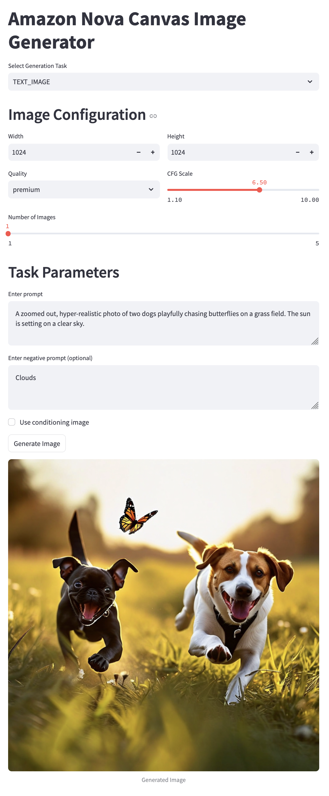

# Amazon Nova Canvas Image Generation Web App

A Streamlit-based web interface for image generation using Amazon Nova Canvas through AWS Bedrock API



## Features

- **Multiple Generation Modes**:
  - 🖼️ Text-to-Image
  - 🎨 Inpainting (mask image/prompt)
  - 🌄 Outpainting (mask image/prompt)
  - 🔄 Image Variation
  - 🎨 Color-Guided Generation
  - ✂️ Background Removal
  - 🖌️ Conditioning Image Support

- **Advanced Features**:
  - Multiple image generation (1-5 outputs)
  - Image dimension controls (512-2048px)
  - Quality settings (Standard/Premium)
  - CFG Scale adjustment
  - Batch download as ZIP
  - Background removal preprocessing
  - Mask processing options

## Prerequisites

- Python 3.9+
- AWS Account with Bedrock access
- Nova Canvas model access
- (Optional) IAM credentials with Bedrock permissions

## Installation

1. Clone repository:
```shell
git clone https://github.com/yourusername/nova-canvas-webapp.git
cd nova-canvas-webapp
```

2. Install dependencies:
```shell
pip install -r requirements.txt 
```

3. Configure AWS credentials:
```shell
[default]
aws_access_key_id = YOUR_ACCESS_KEY
aws_secret_access_key = YOUR_SECRET_KEY
```

## Usage

1. Start the app:
```shell
streamlit run app.py
```

2. Select task type from dropdown

3. Configure parameters:
   - Common parameters (dimensions, quality, CFG scale)
   - Task-specific inputs (images, masks, prompts)
   - Advanced options (background removal, conditioning)

4. Generate and download results:
   - Individual image downloads
   - ZIP archive for multiple outputs
   - Direct AWS API error handling


## Key Components

### `NovaCanvasGenerator` Class
- Handles all Bedrock API communications
- Supports all Nova Canvas task types
- Implements error handling and retries
- Manages image encoding/decoding

### Streamlit Interface
- Dynamic UI based on task selection
- Image upload and preview
- Parameter validation
- Batch processing controls
- Download handlers

## Notes

- **Supported Formats**: PNG, JPEG, JPG
- **Max Images**: 5 per generation
- **Recommended Sizes**: Multiples of 64px
- **Rate Limits**: Follow AWS Bedrock service quotas

## Troubleshooting

Common Issues:
- `CredentialsError`: Verify AWS configuration
- `InvalidImageData`: Check file uploads
- `APIParameterError`: Validate input requirements
- `RateLimitExceeded`: Bedrock API call limit exceeded
